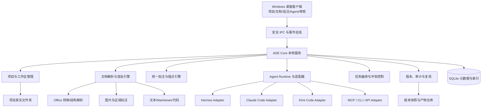

# ADE Windows 程序框架设计方案

> 文档状态：方案框架（不含具体实现）  
> 建议产品释义：**ADE = Agentic Document Environment（智能体文档与研发环境）**  
> 目标平台：Windows 10/11，优先支持本地项目、本地文件和本地/远程 Agent

## 1. 产品定位

ADE 不是单纯的聊天客户端，也不是传统 IDE，而是一个以“项目、文件、批注、任务和可追溯修改”为核心的多 Agent 工作台。

它将文档阅读器、图片查看器、Office 文件预览器、项目文件管理器、多 Agent 控制台和修改审核界面整合到一个 Windows 应用中。用户可以在任意文档元素上圈选、批注，将批注连同精确位置和必要上下文发送给指定 Agent，再审核 Agent 产生的修改。

参考 Claude Science 的核心思想，但不限定于科研场景：统一工作环境、丰富文件原生展示、可复现产物、内联批注、多 Agent 协作、完整操作历史，以及本地/远程算力接入。Claude Science 的公开介绍可作为产品设计参考：[Claude Science, an AI workbench for scientists](https://www.anthropic.com/news/claude-science-ai-workbench)。

### 1.1 核心价值

- 一个项目对应一个真实文件夹，所有 Agent 默认以该项目根目录作为工作目录。
- 同一项目可同时配置 Hermes、Claude Code、Kimi Code 及其他 Agent。
- 用户面对的是文件和成果，而不是孤立的聊天窗口。
- 批注是可执行的任务入口，不只是静态备注。
- Agent 的读取、推理、命令、文件修改和验证过程均可追踪、暂停和审核。
- 文本、图片、Word、PowerPoint、Excel 等文件使用统一的“定位—批注—派发—修改—验收”闭环。

### 1.2 首期不追求的能力

- 不自行训练或托管大模型。
- 不在首期完整替代 Microsoft Office、Photoshop 或专业科学软件。
- 不允许多个 Agent 无协调地同时覆写同一文件。
- 不默认给予 Agent 全盘文件访问、管理员权限或无限制网络权限。

## 2. 典型用户流程

1. 用户新建或导入一个项目，选择本地文件夹作为项目根目录。
2. ADE 扫描文件、建立索引，并恢复该项目的 Agent、会话和批注。
3. 用户为项目启用多个 Agent，例如 Hermes、Claude Code 和 Kimi Code。
4. 用户打开 Markdown、图片、Word、PPT 或 Excel 文件。
5. 用户选中文字、段落、图片区域、幻灯片对象或单元格范围并添加批注。
6. 用户选择一个 Agent，或交给“协调 Agent”自动分派。
7. ADE 将批注、精确锚点、上下文、相关附件和任务约束组成结构化任务包。
8. Agent 在项目根目录中执行任务，ADE 实时展示计划、命令、工具调用和产物。
9. ADE 对文本显示 diff，对图片显示前后对比，对 Office 文件显示结构化或渲染后对比。
10. 用户接受、部分接受、退回修改，批注随之标记为已解决、待复核或驳回。

## 3. 总体架构



### 3.1 推荐技术选型

| 层级 | 推荐方案 | 说明 |
|---|---|---|
| 桌面壳 | Tauri 2 + WebView2 | 安装包较小，Rust 权限边界清晰，适合 Windows 本地能力 |
| 前端 | React + TypeScript | 组件生态成熟，适合多面板、编辑器和文档画布 |
| 核心服务 | Rust | 负责进程、文件、索引、权限、IPC、任务和版本管理 |
| 文本编辑 | Monaco Editor | Markdown、代码、纯文本的编辑、选择和 diff |
| 富文档画布 | 自研统一 Canvas/DOM Viewer | 承载分页、元素层、选择层、批注层和对比层 |
| 终端 | xterm.js + Windows ConPTY | 承载交互式 CLI Agent 和普通终端 |
| 本地数据库 | SQLite（WAL 模式） | 保存项目、会话、批注、任务、锚点和审计事件 |
| 搜索索引 | SQLite FTS5，后续可插拔向量索引 | 首期完成关键词检索，语义检索按需添加 |
| Office 转换 | LibreOffice headless | 首期将 DOCX/PPTX/XLSX 转为 PDF/HTML/图片用于稳定预览 |
| Office 结构读取 | OOXML 解析器 | 保留段落、表格、幻灯片、形状、工作表和单元格的逻辑定位 |
| 密钥保存 | Windows Credential Manager / DPAPI | API Key 不进入项目文件和普通配置文件 |

Electron 也可实现，但若没有现成 Electron 团队或必须使用 Node 原生生态，优先采用 Tauri。Office 的“完整原生编辑”不建议作为 MVP 前置条件；可在第二阶段评估 ONLYOFFICE、本机 Office COM 自动化或 Microsoft 365 Web 集成，并单独审查授权与部署条件。

## 4. 核心模块

### 4.1 项目与工作区管理

每个项目绑定一个真实目录，禁止使用仅存在于应用内部的虚拟文件系统。Agent 启动时必须显式设置 `cwd = project.rootPath`。

项目能力包括：

- 新建空项目、导入已有文件夹、最近项目、收藏和归档。
- 项目级 Agent 配置、默认 Agent、模型、权限和环境变量。
- 文件树、标签、全文搜索、最近打开、收藏文件和忽略规则。
- Git 仓库识别、状态展示、提交历史和可选的版本恢复。
- 项目级知识说明，如 `ADE.md`、术语表、风格指南、输出规范和 Agent 指令。
- 大文件、临时文件、密钥文件和敏感目录的索引排除。

建议项目结构：

```text
<project-root>/
├─ .ade/
│  ├─ project.yaml          # 可共享的项目配置
│  ├─ instructions.md       # 项目统一说明
│  ├─ agents.yaml           # 项目 Agent 声明，不保存密钥
│  ├─ comments/             # 可选：可共享批注导出
│  └─ ignore                # 索引与上下文排除规则
├─ docs/
├─ data/
├─ outputs/
└─ ...
```

设备私有状态、缓存、数据库、凭据和大体积预览文件存入 `%LOCALAPPDATA%/ADE/`，避免污染项目或被意外提交。项目内 `.ade` 只保存适合共享和版本控制的声明式配置。

#### 4.1.1 逻辑项目路径与运行时路径

本地 Windows Agent 的 `cwd` 必须是项目真实目录。对于 WSL、Docker、SSH 或 HPC，物理路径可能不同，因此内部统一使用项目相对路径，并维护显式映射：

```yaml
workspaceBinding:
  hostRoot: D:/projects/example
  runtimeRoot: /workspace
  runtime: docker
  pathMapping:
    - from: D:/projects/example
      to: /workspace
```

- `hostRoot`：用户在 Windows 中看到的真实项目目录。
- `runtimeRoot`：Agent 所在运行环境看到的项目目录。
- `pathMapping`：日志、工具事件和产物路径的双向转换规则。
- 批注、任务和审计记录只保存项目相对路径，避免环境变化后失效。

### 4.2 Agent Runtime 与适配层

ADE 不直接绑定任何一家 Agent，而是定义统一的 `Agent Provider` 接口。每种 Agent 以适配器方式接入。

统一接口分为必选能力和可选能力，不能假设所有终端 Agent 都提供结构化事件。

必选接口：

- `detect()`：检测命令是否安装、版本和登录状态。
- `capabilities()`：声明流式输出、工具调用、图像输入、断点续跑、结构化输出等能力。
- `startSession(projectRoot, config)`：在项目根目录启动会话。
- `sendTask(taskEnvelope)`：发送结构化任务。
- `streamOutput()`：输出原始或结构化消息流。
- `cancel()`：终止当前任务，并清理其子进程。
- `collectResult()`：返回修改文件、生成产物、验证结果和任务摘要。

可选接口：

- `streamSemanticEvents()`：输出计划、工具调用、命令、diff、产物和错误事件。
- `pause()/resume()`：Agent 本身支持时才启用。
- `interceptPermission()`：仅在 Provider 能拦截工具调用时提供。
- `resumeSession()`：使用 Provider 的原生会话标识恢复。
- `estimateContext()`：按具体模型和分词器估算上下文与费用。

适配器能力分为四级：结构化 SDK、结构化 JSONL/RPC、终端增强、纯终端降级。纯终端模式只能可靠控制进程、记录输出和检测文件变化，界面不得声称能够精确识别每一次工具调用或在调用前拦截权限。

建议支持四类接入协议：

1. **CLI/ConPTY**：适配 Claude Code、Kimi Code 等交互式命令行 Agent。
2. **stdio JSONL/RPC**：适配 Hermes 或具备结构化事件输出的本地 Agent。
3. **REST/WebSocket**：接入远程 Agent 服务、企业网关和自建模型平台。

MCP 归入 `tool-connector`，用于向 Agent 暴露工具和数据源，不作为完整 Agent 会话生命周期协议。适配器负责协议翻译和能力声明；任务策略、审计、UI 事件以及 ADE 能够实际强制的权限由 Core 统一处理。

Agent 配置示意：

```yaml
agents:
  - id: hermes-main
    provider: hermes
    transport: stdio-jsonl
    command: hermes
    role: research
  - id: claude-editor
    provider: claude-code
    transport: conpty
    command: claude
    role: document-editor
  - id: kimi-reviewer
    provider: kimi-code
    transport: conpty
    command: kimi
    role: reviewer
```

具体命令参数不能硬编码在产品中，应由版本化适配器和用户配置共同决定。

### 4.3 多 Agent 调度

同一项目可以存在多个独立 Agent 会话，支持三种模式：

- **直接模式**：用户将批注直接发送给某个 Agent。
- **协调模式**：协调 Agent 拆分任务，并将子任务分给研究、写作、编码、数据分析或审阅 Agent。
- **流水线模式**：按预设流程执行，例如“生成初稿 → 数据核验 → 引用检查 → 语言润色 → 用户验收”。

多个 Agent 默认共享逻辑项目，但执行分为两种模式：

- **直接事务模式（MVP）**：Agent 直接在真实项目目录写入。ADE 在任务前创建快照并监测变化；“接受”表示保留当前变更，“拒绝”表示从快照恢复。此模式不能承诺接受前文件完全不落地。
- **隔离候选模式（阶段 2）**：每个 Agent 在项目副本、Git Worktree 或受控写入层中生成候选变更；用户接受后再合并到真实项目。并行 Agent 和结果对比必须使用该模式。

直接事务模式中的文件锁属于协调控制：

- Agent 写文件前声明预计修改范围。
- ADE 为任务分配文件级写锁，其他受 ADE 调度的 Agent 必须遵守。
- 未声明修改的文件发生变化时，立即提示越界写入。
- 两个 Agent 需要修改同一文件时，排队执行或生成独立补丁，由用户合并。
- 外部进程不受应用级文件锁约束，因此仍需快照、文件监视和恢复机制。

每项任务形成 DAG 节点，记录负责人、依赖、输入、输出、状态、占用文件和验收条件。任务状态建议统一为：`draft → queued → running → waiting_permission → review → accepted/rejected/failed`。

### 4.4 文件读取、渲染与编辑

采用“格式适配器 + 统一文档模型”架构。格式适配器负责解析和渲染，统一模型负责元素定位、选择、批注和上下文提取。

| 文件类型 | MVP 展示方式 | 选择/批注粒度 | Agent 修改方式 |
|---|---|---|---|
| Markdown/纯文本/代码 | Monaco 原生打开 | 字符、单词、行、段落 | 文本补丁/diff |
| PDF | 分页画布 + 文本层 | 文本范围、页面区域 | 修改源文件或生成新版本 |
| PNG/JPEG/WebP/BMP/GIF/TIFF/SVG | 图片画布 | 点、矩形、圆、多边形、自由笔 | 编辑源文件或生成替代图 |
| DOCX | OOXML 结构解析 + 渲染预览 | 词、句、段落、表格、图片、页区 | Agent 修改 OOXML/调用转换工具后重渲染 |
| PPTX | 幻灯片渲染 + 对象层 | 幻灯片、形状、文本范围、图片区 | 修改 OOXML或调用演示文稿工具 |
| XLSX | 表格网格 + 公式/样式信息 | 单元格、区域、行列、图表、工作表 | 修改工作簿结构并显示单元格级差异 |
| CSV/TSV/JSON/XML/YAML | 表格或结构化查看器 | 字段、节点、单元格 | 结构化补丁或文本 diff |
| Notebook | 单元格视图 | 单元格、输出、图表区域 | 修改单元格并可选重新执行 |

Office 文件建议同时保留两套结果：

- **结构模型**：用于准确定位内容、提取上下文和结构化修改。
- **视觉快照**：用于显示版面、圈选区域和修改前后对比。
- **RenderMap**：记录源元素 ID 与页面、幻灯片或网格坐标之间的映射，并保存渲染器版本、字体替换、缩放和映射置信度。

LibreOffice 转换结果通常不能直接保留全部 OOXML 元素标识，因此 RenderMap 必须作为独立的技术验证项。无法可靠映射时，批注应降级为“页面区域 + 局部截图 + 精确引文”，并明确显示定位精度。

如果本机没有兼容渲染器，ADE 应显示能力降级原因，并允许“仅结构查看”或“使用外部默认程序打开”。所有格式都应保留“在资源管理器中显示”和“使用系统默认应用打开”。

### 4.5 统一圈选与批注系统

批注系统是 ADE 的关键基础设施，不能只保存页码和坐标，否则文档修改后批注会漂移。每个批注使用多重锚点：

```json
{
  "fileId": "stable-file-id",
  "fileVersion": "sha256:...",
  "targetType": "text|region|cell-range|shape|object",
  "logicalAnchor": {
    "part": "document.xml",
    "elementId": "paragraph-42",
    "start": 12,
    "end": 26
  },
  "quoteAnchor": {
    "prefix": "前文",
    "exact": "被圈选内容",
    "suffix": "后文"
  },
  "visualAnchor": {
    "page": 3,
    "x": 0.21,
    "y": 0.36,
    "width": 0.28,
    "height": 0.08
  }
}
```

不同格式的优先锚点：

- Markdown/文本：字符范围 + 行列 + 精确引文及前后文。
- Word：OOXML 部件 + 段落/表格 ID + 文本范围 + 页面区域。
- PowerPoint：幻灯片 ID + 形状 ID + 文本范围 + 区域。
- Excel：工作表稳定 ID + 单元格/命名区域 + 公式快照。
- 图片：归一化坐标、多边形路径、缩放/旋转信息和局部缩略图。
- PDF：页面 + 文本字形范围 + 归一化区域 + 精确引文。

文件变化后，锚点引擎依次尝试结构 ID、精确引文、模糊上下文和视觉位置重定位，并输出置信度。低置信度批注必须标为“需要重新定位”，不能静默附着到错误内容。

批注本身支持：

- 单条批注、讨论线程、回复、@Agent 和 @成员。
- 严重程度、标签、负责人、截止时间和状态。
- “修改”“解释”“核验”“重写”“补充引用”“调整图形”等意图模板。
- 同时选择多个不连续区域组成一条批注。
- 将多条批注合并为一个 Agent 任务，或批量派发。
- 私有批注、项目共享批注和可导出批注。

一条批注可以包含一个或多个 `AnnotationTarget`。跨文件批注通过目标数组表达，而不是在 `Annotation` 上保存单个 `fileId`：

```text
Annotation
└─ AnnotationTarget[]
   ├─ fileId
   ├─ fileVersion
   ├─ anchor
   └─ selectedSnapshot
```

### 4.6 批注到 Agent 的任务闭环

发送给 Agent 的不是一段拼接文本，而是结构化 `Task Envelope`：

```json
{
  "taskId": "task-uuid",
  "projectRoot": "D:/projects/example",
  "agentId": "claude-editor",
  "instruction": "根据批注修改并保持全文术语一致",
  "comments": ["comment-uuid"],
  "targets": ["structured-anchor"],
  "context": {
    "selectedContent": "...",
    "surroundingContent": "...",
    "relatedFiles": ["docs/report.docx"],
    "projectInstructions": ".ade/instructions.md"
  },
  "constraints": {
    "allowedWritePaths": ["docs/report.docx"],
    "network": "ask",
    "commands": "ask-on-risk",
    "expectedOutput": "patch-and-summary"
  },
  "acceptance": ["批注已处理", "原格式未损坏", "通过重新渲染检查"]
}
```

完整闭环：

```text
圈选 → 批注 → 选择 Agent → 生成任务包 → 权限检查
     → Agent 执行 → 产物验证 → 差异预览 → 用户验收
     → 接受并解决批注 / 退回并继续会话 / 恢复原版本
```

Agent 收到的视觉批注还应包含带高亮框的局部截图；收到表格批注时应包含单元格值、公式、格式和相邻区域；收到文字批注时应包含精确选区、前后文和文档结构路径。

### 4.7 修改审核与版本系统

ADE 必须为 Agent 修改提供审核与恢复层。直接事务模式下文件已经被 Agent 写入，审核决定“保留或恢复”；隔离候选模式下审核决定“是否合并到真实项目”。界面必须明确显示当前执行模式，避免用户误以为变更尚未落地。

- 文本：行级、词级和语义分组 diff，可逐块接受。
- Word：段落、表格、图片和样式变更列表，并显示重渲染前后对比。
- PowerPoint：按幻灯片/对象显示变更，支持叠加对比和并排对比。
- Excel：新增/删除工作表、单元格值、公式、格式和图表数据差异。
- 图片：滑块、闪烁、叠加和局部放大对比。
- 二进制文件：绝不只显示“文件已变化”，必须生成结构摘要和视觉快照。

每个任务执行前创建轻量快照；接受后形成一个版本节点。若项目是 Git 仓库，可将接受操作映射为暂存区或独立提交，但不强制自动提交。非 Git 项目使用内容寻址快照保存恢复点，并配置空间上限和清理策略。

## 5. 界面框架

建议采用可停靠的多面板布局：

```text
┌──────────────────────────────────────────────────────────────────┐
│ 项目切换 / 全局搜索 / 当前 Agent / 运行状态 / 权限与通知          │
├────────────┬───────────────────────────────────┬─────────────────┤
│ 项目侧栏   │ 文档工作区                         │ Agent/批注侧栏 │
│            │                                   │                 │
│ 文件       │ 标签页：Markdown / 图片 / Office  │ 会话            │
│ 批注       │ 圈选层、批注层、diff 层            │ 任务            │
│ 任务       │                                   │ 批注详情        │
│ Agent      │                                   │ 权限请求        │
├────────────┴───────────────────────────────────┴─────────────────┤
│ 终端 / Agent 事件流 / 问题 / 变更文件 / 验证结果                 │
└──────────────────────────────────────────────────────────────────┘
```

关键交互：

- 选区出现浮动工具条：“批注、发送给 Agent、解释、重写、核验、加入任务”。
- 批注侧栏与正文双向定位；点击任一方都能高亮另一方。
- Agent 卡片显示角色、模型、当前任务、文件锁、上下文占用和费用/令牌估算。
- 用户可拖动批注到 Agent 卡片完成派发。
- 同一文档可切换“阅读、批注、编辑、审核”四种模式。
- 任务运行时清楚区分 Agent 的自然语言、计划、命令、工具调用和文件修改。
- 危险权限请求必须说明“将做什么、影响哪些文件、是否可恢复”。

## 6. 数据与接口模型

### 6.1 主要实体

| 实体 | 关键字段 |
|---|---|
| Project | id、rootPath、name、settings、createdAt |
| File | id、projectId、relativePath、mime、hash、version |
| DocumentElement | id、fileId、type、logicalPath、contentHash |
| Annotation | id、body、status、author、threadId、priority |
| AnnotationTarget | id、annotationId、fileId、fileVersion、anchor、selectedSnapshot |
| AgentProfile | id、provider、transport、role、capabilities、policy |
| ModelProfile | id、provider、model、contextLimit、tokenizer、pricing |
| Session | id、projectId、agentId、state、resumeToken |
| Task | id、sessionId、inputs、constraints、status、acceptance |
| Artifact | id、taskId、path、type、hash、provenance |
| ChangeSet | id、taskId、beforeVersion、afterVersion、diff |
| AuditEvent | id、actor、action、target、timestamp、details |

### 6.2 内部事件协议

所有 Agent 输出转换为统一事件，便于 UI 与适配器解耦：

- `message.delta`
- `plan.updated`
- `tool.requested / tool.completed`
- `command.requested / command.output`
- `permission.requested / permission.resolved`
- `file.read / file.write / file.deleted`
- `artifact.created`
- `validation.completed`
- `task.paused / task.completed / task.failed`

事件只追加写入审计日志。系统定期生成带模式版本的状态检查点，并对旧事件执行归档与压缩；UI 从最近检查点加后续事件重建，避免项目运行时间越长、恢复越慢。

## 7. 安全、权限与隐私

### 7.1 权限模型

权限按项目和 Agent 分开配置，默认最小权限：

- 文件读取范围：项目内、额外授权目录、禁止目录。
- 文件写入范围：任务声明文件、项目内任意文件、完全禁止。
- 命令执行：安全命令自动、风险命令询问、全部询问。
- 网络访问：禁止、白名单、每次询问、允许。
- 外部应用、剪贴板、环境变量、SSH 和远程算力分别授权。
- 删除、覆盖大量文件、安装软件、提权、上传数据始终需要确认。

Windows 层建议使用受限进程令牌、Job Objects、禁用子进程逃逸、ConPTY 和可选 Windows Sandbox/AppContainer。需要明确：Job Objects 和 ConPTY 本身不能限制文件路径，应用级文件锁也只是建议性约束。强制路径隔离必须依赖 NTFS ACL、隔离工作区、AppContainer 或代理式文件访问。所有路径授权都应解析最终目标，阻止 Agent 通过符号链接、目录联接或大小写/规范化差异逃出授权目录。

### 7.2 数据安全

- API Key 使用 Windows Credential Manager 或 DPAPI 加密。
- 任务包在发给云端 Agent 前显示将被发送的文件和文本范围。
- 支持敏感字段检测、脱敏规则和“仅本地 Agent”项目模式。
- 审计记录包括 Agent 读取了什么、执行了什么、修改了什么、上传了什么。
- 临时转换文件和预览缓存可一键清理，并遵守项目保留策略。
- 企业版预留代理、证书、单点登录、设备策略和集中审计接口。

## 8. 可靠性与可复现性

- 每项 Agent 任务记录 Agent/模型版本、提示词、工具版本、环境变量白名单、输入文件哈希和输出哈希。
- 生成图表、数据或文档时，尽量保存对应脚本、参数和运行日志。
- Agent 崩溃不影响主程序；适配器进程和文档转换进程均独立托管。
- Office 转换、图片解码和第三方预览器在隔离进程中运行，避免恶意文件拖垮主进程。
- 文件写入采用临时文件、格式验证、原子替换和自动快照，避免半写入损坏。
- 对 DOCX/PPTX/XLSX 修改后执行 OOXML 完整性检查并重新渲染。
- 对 `.docm/.xlsm/.pptm` 等宏文件默认禁止执行宏，检测签名和宏二进制是否变化；任何签名失效或宏变更都必须单独提示。
- 提供 Reviewer Agent，可复核引用、数字、公式、图表数据来源和批注完成情况，但最终接受权属于用户。

## 9. 面向科研和专业工作的扩展

为接近 Claude Science 的完整体验，可在基础平台稳定后增加：

- Jupyter、R、Python 环境和 Notebook 执行。
- SSH、WSL、Docker、远程 Linux、GPU 和 HPC 作业入口。
- PubMed、Crossref、arXiv、UniProt、PDB 等连接器。
- 引用管理器、DOI 元数据、参考文献一致性和可追溯数字检查。
- 3D 分子/蛋白结构、基因组轨道、显微图像、DICOM 等专业查看器插件。
- 可复用 Skills/Workflow 市场，让实验室或团队固化标准流程。
- 项目模板，如文献综述、数据分析、论文撰写、专利分析和技术报告。

这些能力应建立在通用插件协议上，不应写死在 ADE Core 中。

## 10. 插件与扩展机制

建议定义四类插件：

- `agent-provider`：新增 Agent 和传输协议。
- `document-provider`：新增文件解析、渲染、选择和差异比较能力。
- `tool-connector`：新增数据库、搜索、实验平台或企业系统连接器。
- `workflow-template`：新增任务 DAG、角色和验收规则。

插件清单必须声明版本、入口、权限、支持的格式/能力和签名。第三方插件默认在独立进程运行，升级失败时可回滚。MCP 适合作为工具连接协议，但不能替代 ADE 自身对文件权限、审计、批注锚点和任务生命周期的管理。

## 11. 分阶段路线图

### 阶段 0：技术验证（2–4 周）

- Tauri、React、Rust Core 和 SQLite 骨架。
- Windows ConPTY 启动一个 CLI Agent，并确保 `cwd` 为项目根目录。
- Markdown 选区批注，生成结构化任务并接收文件 diff。
- DOCX/PPTX/XLSX 转换预览的质量和性能验证。
- 验证 OOXML 结构元素与渲染页面之间的 RenderMap 精度和降级策略。
- 验证纯终端 Agent、JSONL Agent 的能力分级与取消/恢复边界。

验收标准：从 Markdown 圈选一句话，发送给一个 Agent，审核并接受修改，全过程可恢复和追踪。

### 阶段 1：MVP（8–12 周）

- 多项目、文件树、搜索和项目配置。
- Hermes、Claude Code、Kimi Code 三个适配器的最小可用版本。
- Markdown、文本、常见图片、PDF、DOCX、PPTX、XLSX 查看。
- 文本范围、图片区域、Office 逻辑元素的批注。
- 可配置多个 Agent，但任务采用直接事务模式串行执行。
- 单任务闭环、权限确认、文本 diff、文件快照和拒绝后恢复。
- 外部程序打开和错误降级。

### 阶段 2：协作与高级审核（8–12 周）

- 隔离候选工作区、并行 Agent、结果对比、任务 DAG 和 Reviewer Agent。
- Office 结构化 diff、视觉对比和更稳定的锚点重定位。
- Git 集成、批注导入导出、项目模板和工作流模板。
- 可插拔 Agent/文档/工具协议。

### 阶段 3：专业化平台

- Notebook、Python/R、SSH/WSL/HPC。
- 科研数据源、专业可视化和引用核验。
- 团队协作、权限中心、远程同步和企业审计。
- Office 深度编辑方案，根据授权、兼容性和用户需求独立决策。

## 12. MVP 优先级

必须优先保证的能力：

1. 项目根目录与 Agent `cwd` 严格一致。
2. Agent 接入接口稳定，三种 Agent 的差异被适配层吸收。
3. 批注能在文件变化后可靠重定位。
4. Agent 修改必须可审核、可拒绝、可恢复。
5. Office 和图片即使不能完整编辑，也必须能可靠查看、圈选和传递上下文。
6. 多 Agent 并发写入不会破坏项目文件。
7. 所有外部访问和危险操作都有清晰权限边界。

可以后置的能力：

- 实时多人协作。
- 完整 Office 原生编辑。
- 插件市场。
- 跨设备云同步。
- 大规模向量数据库和自动知识图谱。
- 复杂的自主 Agent 群体决策。

## 13. 关键风险与应对

| 风险 | 影响 | 应对方式 |
|---|---|---|
| CLI Agent 输出格式变化 | 适配器失效 | 版本检测、契约测试、适配器独立升级、优先结构化协议 |
| Office 渲染不一致 | 批注位置漂移 | 结构锚点 + 视觉锚点 + 文件哈希，多渲染器能力降级 |
| 多 Agent 同时改文件 | 覆盖或冲突 | 文件锁、变更声明、任务队列、补丁审核 |
| 二进制文件难以 diff | 用户无法判断修改 | OOXML 结构 diff + 重渲染视觉对比 |
| Agent 越权访问 | 隐私或数据损失 | 最小权限、路径校验、进程隔离、危险操作确认、审计 |
| 上下文过大 | 成本高且效果下降 | 只发送选区、邻近结构、相关文件摘要和按需检索结果 |
| 批注随内容变化丢失 | 任务与原文脱节 | 多重锚点、置信度、人工重定位和版本快照 |
| 第三方编辑组件授权复杂 | 发布受阻 | MVP 使用开源转换预览，深度编辑单独立项评估 |

## 14. 最终建议

ADE 的第一原则应是：**以可定位的文件内容为中心，以批注为任务入口，以 Agent 为可替换执行者，以审核和版本为安全边界。**

首版不应追求“什么都能直接编辑”，而应先打通最有差异化的闭环：

> 在真实项目中打开多种文件 → 精确圈选和批注 → 发送给任意 Agent → Agent 在项目目录执行 → ADE 展示可理解的修改 → 用户验收并可恢复。

只要这个闭环稳定，后续增加新 Agent、新格式、科研工具、远程算力和团队协作都可以通过适配器与插件逐步扩展，而无需重构产品核心。

---

第 6 项在 MVP 中通过串行调度实现，在阶段 2 中通过隔离候选工作区实现。

## 15. 横切能力设计

### 15.1 离线与弱网能力

ADE 同时支持本地和远程 Agent。需要区分“Agent 进程在本地运行”和“模型完全本地运行”：只有模型、工具和依赖均不访问云端时，才能标记为完全离线。

- **完全离线模式**：仅启用已声明无需网络的模型与工具，网络策略强制设为禁止。
- **任务队列离线缓存**：弱网时任务包可入队；恢复连接后重新校验文件版本、权限和待发送内容，并经用户授权后派发。
- **Agent 输出本地化存储**：流式事件、diff 和产物全部落盘，断网后可继续审核已完成的任务。
- **确定性资产缓存**：按内容哈希缓存文档解析、Office 预览、嵌入、缩略图和明确可复用的摘要；默认不缓存通用模型推理结果。

### 15.2 上下文预算与智能裁剪

第 13 节提到"上下文过大"风险，建议进一步设计上下文管理策略：

- **上下文预算协议**：`ModelProfile` 声明上下文窗口、分词器和保留预算，ADE 在生成 Task Envelope 时自动裁剪。
- **摘要优先级**：按"精确选区 → 紧邻上下文 → 文件结构摘要 → 跨文件关联摘要 → 项目级指令"的优先级组装。
- **分级加载**：Agent 可请求更多上下文，ADE 按需追加，而非一次性发送全部。
- **上下文预览**：用户在派发前可预览实际发送给 Agent 的完整内容，避免意外泄露。

### 15.3 Agent 间通信与协作协议

当前"协调模式"和"流水线模式"较抽象，建议细化：

- **黑板模式（Blackboard）**：多 Agent 共享一个结构化"黑板"区域，各自读取所需上下文、写入结论，ADE 负责冲突检测。
- **消息总线**：Agent 之间可通过 ADE 中转消息（而非直接通信），便于审计和控制。
- **接力协议**：Agent A 完成后可将中间产物和"交接说明"传给 Agent B，交接说明包含已完成项、未完成项和注意事项。
- **人介入点**：流水线中可插入"人工审核节点"，流程暂停等待用户确认后继续。

### 15.4 批注系统的增强建议

- **批注模板库**：预置常见批注模板（"术语不一致"、"引用缺失"、"数据待核验"、"表述优化"等），降低用户输入成本。
- **批注历史回放**：可回放某条批注从创建到解决的完整生命周期，查看每个 Agent 的响应和处理过程。
- **批注批量操作**：按文件、标签、严重程度筛选批注，批量派发或批量关闭。
- **跨文件批注**：一条批注可关联多个文件的选区（例如"报告中引用的数据与表格不一致"）。
- **批注优先级与调度**：高优先级批注自动排到任务队列前面。

### 15.5 文件格式支持的补充

- **Markdown 实时预览**：除 Monaco 编辑视图外，建议支持 Markdown 渲染预览 + 批注模式切换，批注可同时附着在源码和渲染结果上。
- **PDF 写入能力**：首期 PDF 只读，但应预留 PDF 注释写入（如 highlights、comments）的接口设计。
- **图片标注持久化**：圈选区域应可保存为 overlay 图层（SVG/JSON），与原图分离，避免破坏原始图片。
- **Office 公式与宏**：XLSX 公式差异应结构化展示；对 `.xlsm/.docm/.pptm` 检测 VBA、数字签名和宏二进制变化，且预览过程绝不执行宏。
- **CAD/SPICE/专业格式**：预留 `document-provider` 插件接口，未来支持专业工程格式。

### 15.6 UI/UX 补充建议

- **快捷键体系**：批注、派发、接受/拒绝、切换 Agent 等高频操作应有完整快捷键映射。
- **命令面板**：类似 VS Code 的 `Ctrl+Shift+P`，支持快速执行项目操作、文件跳转和 Agent 调用。
- **Agent 对比视图**：同一批注可发送给多个隔离候选工作区，结果并排展示，用户选择一个或组合多个补丁。
- **迷你地图**：文档侧边显示批注密度迷你地图，快速定位待处理区域。
- **深色/浅色主题**：Office 渲染和 diff 视图需适配深色模式。
- **可访问性**：支持屏幕阅读器、键盘导航和高对比度模式。

### 15.7 性能与可扩展性补充

- **虚拟滚动**：大文档（1000+ 页 PDF、大型 Excel）必须使用虚拟滚动，避免一次性渲染。
- **增量索引**：文件变化时增量更新索引，而非全量重建。
- **预览缓存**：Office 转换结果按文件哈希缓存，未变化时不重复转换。
- **Agent 并发上限**：按 Agent 类型配置最大并发会话数，避免资源争抢。
- **内存监控**：WebView2 和文档渲染进程的内存占用监控，超阈值自动释放。

### 15.8 部署与分发建议

- **安装包**：Tauri 生成 MSI/NSIS 安装包，支持企业组策略部署。
- **自动更新**：内置更新检查，支持增量更新和回滚。
- **便携版**：可提供免安装版本，但项目缓存、配置与密钥策略必须分开；密钥默认仍进入 Windows Credential Manager，不跟随便携目录复制。
- **企业部署**：支持集中配置推送、代理服务器设置和离线许可激活。
- **依赖管理**：LibreOffice、Python 等外部依赖可选安装，不作为硬性前置条件。

### 15.9 测试策略建议

- **适配器契约测试**：每个 Agent 适配器有自动化契约测试，确保协议变更时及时发现问题。
- **锚点重定位测试**：构造文档修改场景的测试集，验证批注在内容变化后是否正确重定位。
- **端到端闭环测试**：从圈选到 Agent 执行到验收的完整自动化测试，至少覆盖 Markdown 和 DOCX 两种格式。
- **压力测试**：多 Agent 并发、大量批注、大文件渲染的稳定性测试。
- **安全测试**：越权写入、路径穿越、符号链接逃逸和恶意文件渲染的安全测试。

### 15.10 产品命名与定位补充

产品正式释义固定为 **Agentic Document Environment**，保持市场认知一致。软件开发、数据分析和科学研究通过“项目类型”模板提供不同默认布局、Agent 角色和工具组合，不改变产品名称。

---

## 16. 实施基线

进入实现阶段必须遵守以下基线：

1. **MVP 闭环必须完整可用**：从圈选到验收的每个环节都不能断链。
2. **适配器协议必须提前固化**：Agent 接口的稳定性决定了扩展成本。
3. **批注锚点是技术核心**：如果锚点不可靠，整个"批注→任务→修改"闭环就会断裂。
4. **权限边界不可妥协**：Agent 对文件系统的写入必须有严格的沙箱控制。
5. **执行模式必须可见**：直接事务模式与隔离候选模式不可在交互上混淆。
6. **结构和视觉必须可映射**：Office 的 RenderMap 无法可靠建立时必须显式降级。
7. **渐进式扩展**：先做好文本和 Office 预览的圈选→派发→审核，再扩展专业格式和协作能力。
